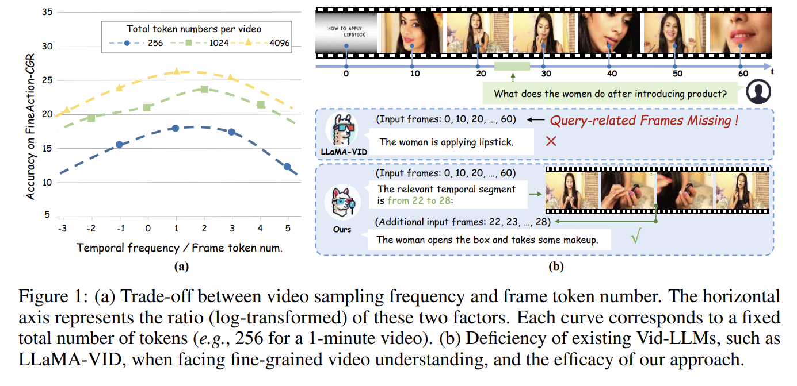

### SlowFocus: Enhancing Fine-grained Temporal Understanding in Video LLM

#### A Trainning and inference strageties
- Purpose: improve temporal localization and fine-grained temporal reasoning capability
- fine-tune Vid-LLM in second on dense video captioning and temporal grounding tasks: to enhance dense video captioning and temporal grounding tasks
- Apply SlowFocus mechanism to Vid-LLM 

#### Method

